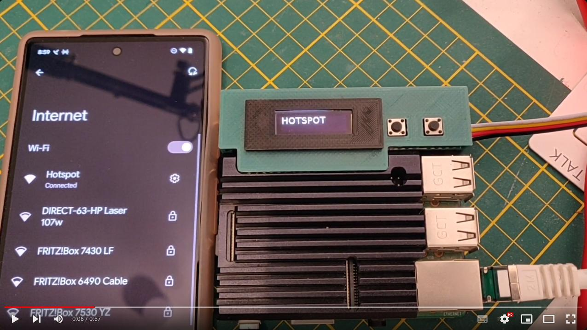
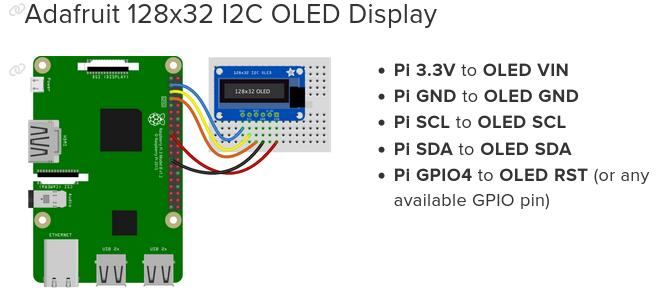
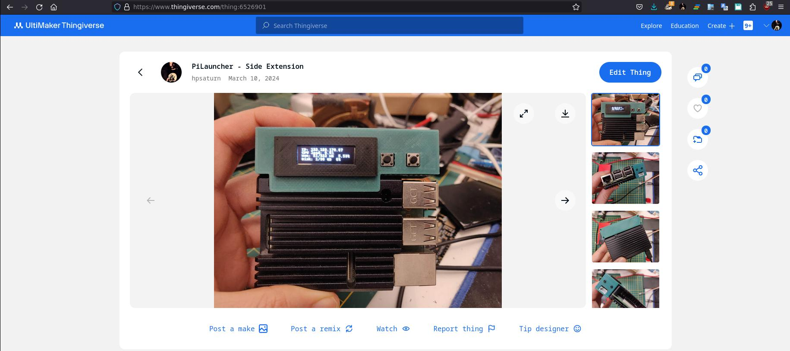

# Raspi Launcher

It is a RaspberryPi apps launcher from only two buttons on headless installations (without monitor or keyboard). You will able to configure any kind of application to launch with it, for example enable or disable your VPN or start your console emulators.

<table>
	<tr>
		<td>
			Don't forget to star ⭐ this repository
		</td>
	</tr>
</table>

## Demo

[](https://youtu.be/iNSw1nZpOEk?si=aX4mq4WVJhwrCm_X)

## Prerequisites

Any one RaspberryPi device with Python3 support. If you don't know how to configure a headless on your Pi, [this documentation](https://www.raspberrypi.com/news/raspberry-pi-bullseye-update-april-2022/) could help you.

## Installation

Enter via SSH in your RaspberryPi and run the next steps:

Raspberry OS dependencies:

```bash
sudo apt install git python3-venv python3-dev libopenjp2-7
```

Python dependencies:

```bash
python3 -m venv ~/.local
~/.local/bin/pip install adafruit-circuitpython-ssd1306 pyyaml pillow Adafruit_PureIO add_service
```

I2C enable:

```bash
sudo raspi-config nonint do_i2c 0
```

Pilauncher service install:

```bash
cd ~/
git clone https://github.com/hpsaturn/pilauncher.git
cp -r pilauncher/utils ~/bin
python3 -m add_service "/usr/bin/python3 /home/YOUR_USER/pilauncher/main.py" --user YOUR_USER --name "pilauncher"
```

## First run

You able to launch this like a simple systemd service with:

```bash
sudo service pilauncher start
```

it will be launched after each reboot. You also could run it like a normal python app with `python3 main.py` e.g for debugging your apps. Don't forget stop first the service.

## App Launcher

This service use a simple YAML file to specify what apps will be launched and also its subservices or commands, like a status or information commands. You able to put whatever.

**Example**:

```yaml
WIFI:
  WiFi On:
    cmd: sudo nmcli connection up YOUR_WIFI_CONNECTION
  WiFi Off:
    cmd: sudo nmcli connection down YOUR_WIFI_CONNECTION
  Status:
    cmd: nmcli c show --active | grep wlan0 | awk '{if(/YOUR_WIFI_CONNECTION/) print "connected:",$1}'
  Back:
    cmd: back
```

In the [apps.yml](https://github.com/hpsaturn/pilauncher/blob/master/apps.yml) file you able to put your apps. There you will found more commented examples.

Also please review the wiki page with [full recipes guides](https://github.com/hpsaturn/pilauncher/wiki/Recipes)

**Reservated names**:

`cmd: back` -> it could help to return a previous level when you only have two buttos. For now the launcher only supports two buttons.

`Status:` -> this reservated name uses its `cmd` for refresh the subtitle of App item in the menu.

`Info:` or `Stats:` -> these sub commands could be only for real time information on the screen. You able to specify 1 or many commands. Each command will be the output for each line. For now it only support four lines. For example, we have a application VPN that uses NordVPN CLI. The first subcommand of this app uses `Info:` reservated name, and its lines will be a realtime information of the current status of the VPN.

```yml
VPN:
  Info:
    l1: /home/pi/bin/vpnstatus
    l2: nordvpn status | grep City | awk '{if(/City:/) print "City:",$2}'
    l3: nordvpn status | grep IP | awk '{if(/IP:/) print "IP:",$2}'
    l4: nordvpn status | grep Transfer | awk '{if(/Transfer:/) print $2.$3,"/",$5.$6}'
  Colombia:
    cmd: nordvpn connect Colombia
  Argentina:
    cmd: nordvpn connect Argentina 
  VPN Off:
    cmd: nordvpn disconnect
  Status:
    cmd: /home/pi/bin/vpnstatus
  Back:
    cmd: back
```

## Settings

In the `settings.yml` file you will found some minimal settings for now:

```yaml
auto_screen_off: True     # reduce CPU consumption and increase OLED life
screen_time_off: 60       # time for auto screen off
info_refresh_rate : 3     # real time refresh. Recommended 3 or more
status_refresh_rate : 5   # refresh for the status field of each app
show_stats_on_boot: False # show the info stats of the first app in the boot
```

## Wiring

**OLED:**

[](https://learn.adafruit.com/monochrome-oled-breakouts/python-wiring)  
[SSD1306 OLED Wiring](https://learn.adafruit.com/monochrome-oled-breakouts/python-wiring)

**Buttons**:

```python
ButtonLeft  -> PIN23
ButtonRight -> PIN6
```

## 3DPrint box

Some photos of the side extension box, please enter [here](https://www.thingiverse.com/thing:6526901) or the last versions [here](https://github.com/hpsaturn/pilauncher/tree/master/box/side_extension).

[](https://www.thingiverse.com/thing:6526901)

## About

Please follow the project updates in [Hackaday](https://hackaday.io/project/193324-raspberrypi-app-launcher)

---
